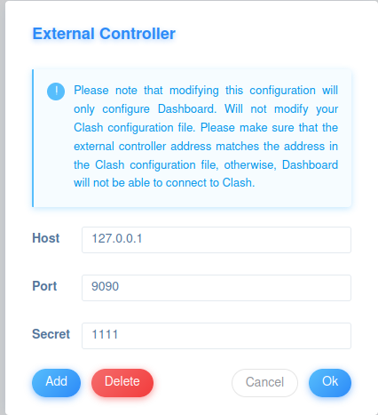
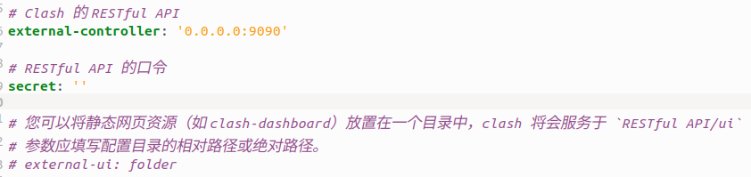
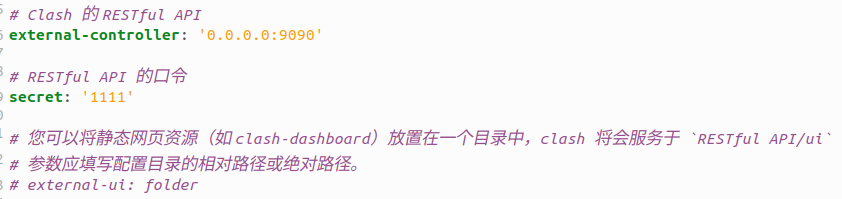
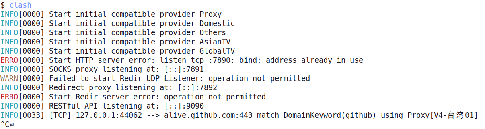
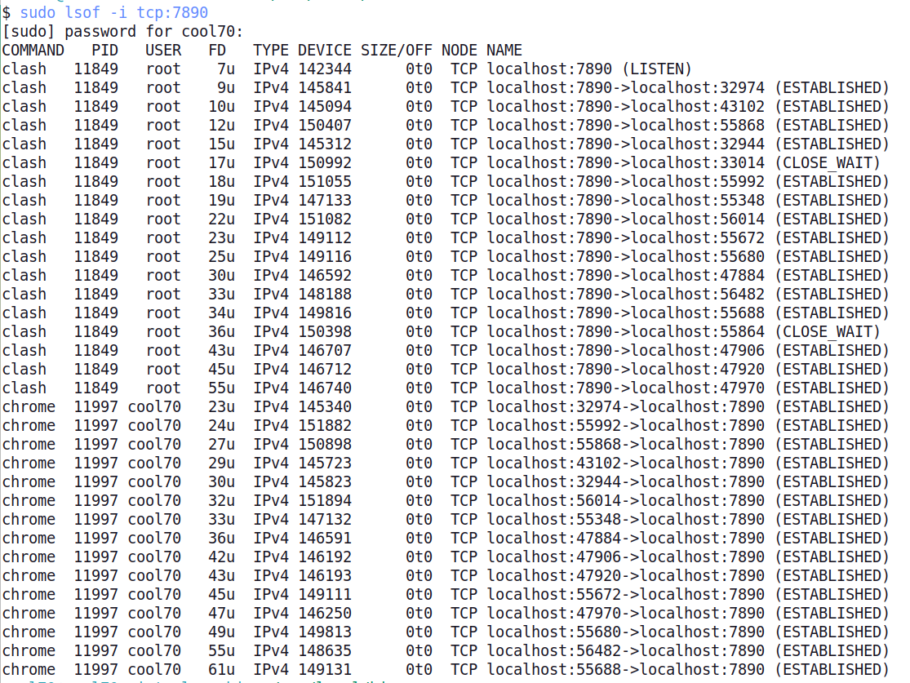

官网和网上其他教程不清不楚的，浪费我好几个小时！！！
特此记录一下
---
**更新说明**</p>
第一次配置成功后，由于没有正确退出clash,第二次启动后完全失效！！！
问题说明及解决办法见[第二次更新](#u2)

# 1. 下载客户端

 1. ~~创建`clash`文件夹以存放后面所需的所有文件~~
    > 更新注：建议将以下文件存放在`/usr/loal/bin`目录下，这样可以在全局任意目录执行`clash`

 2. [下载Clash二进制文件](https://github.com/Dreamacro/clash/releases)

个人64位电脑下载**clash-linux-amd64-v1.16.0.gz**即可(我下载在`Downloads`目录)
 3. 将其解压缩并重命名为clash
   ```
   gzip clash-linux-amd64-v1.16.0.gz
   mv ./clash-linux-amd64-v1.16.0 /usr/loal/bin
   cd /usr/loal/bin
   mv clash-linux-amd64-v1.16.0 clash
   ```

# 2.  下载clash配置文件
在终端 cd 到 clash 二进制文件所在的目录，执行`wget -O config.yml http://***`

> 说明：http://**是代理网站的SSR链接

> **踩的第一个坑：执行语句后，新生成的`config.yml`文件并没有下载下来任何东西。**
> 解决办法：切换成root用户，重新执行该语句。

在文件夹下出现了两个新文件：`config.yml`和`wget-log`
# 3. 启动clash

```
./clash -d .
```
> **踩的第二个坑：提示*permission denied***
> 解决办法：运行权限`chmod +x clash`

> **踩的第三个坑：提示`Can‘t find MMDB, start download错误`**
> 说明：按理说，它应该自己下载MMDB文件，但不知道为什么下载不了，所以需要我手动下载
> 解决办法：1. [下载MMDB文件](https://gitee.com/dnqbob/sp_engine/blob/SPcn-01-02-20/GeoLite2-Country.mmdb.gz)，解压缩并重命名为`Country.mmdb`</p>
> 2. 再次执行`./clash -d .`

> **踩的第四个坑：新生成了`config.yaml`文件, 打开只有一条内容：`mixed port: xxxx`**

> **说明：真的无语，官网不会写教程就不要写，竟然漏了最重要的一步：
> 把配置文件`config.yml`的内容替换到`config.yaml`文件里面！！！**

最后两步：
1. 在ubuntu系统设置网络连接中配置代理：

networkproxy改为手动，参照`config.yml`文件内容如图配置：

> 说明：每个人的代理服务不同，具体设置请查看所购买服务的网站说明

2. 然后再次启动clash: 

终端输入：
```
./clash -d .
```

终端窗口出现：


> **至此成功！**

用acccmip6下载数据简直起飞


---------------------------------------------------------------------------------------------------------------------------------------------
# <div id="u2">更新<div>
我以为这就成功了，结果第二次打开`clash`，连接不了外网，网上找遍了也试遍了，完全不知道为啥。

又搞了一天👺👺👺，终于解决了：

> 其实现在也不太知道具体是什么原因，只能进行一些推测

1. 首先可以查看一下网页版的`clash-board`，发现它一直弹出external controllor(外部控制)：


- 点确定和添加弹窗也不消失，不知道啥意思

2. 查看`~/.config/clash`目录下的`confi.yaml`文件（第三步已经配置好了）

- 关于`external controllor`的部分：


- 9090就是外部控制的出口，这两个要对应起来。
- secret一开始是空白的，需要自行设置。
- 我手动在`confi.yaml`中添加1111这个密钥，保存后再次启动`clash`
- 那么在`clash-board`中，也对应填secret是1111


3. 这个时候也没有成功，发现`clash-board`log一片空白，说明没有流量经过`clash`
4. 再修改`confi.yaml`文件中的`log-level=debug`，重新启动`clash`，让终端输出错误信息


- <div id="u1">第一个错误：<div></p>
- `Start HTTP server error: listen tcp :7890: bind: address already in use`
  > 解决办法：
  > 1. 打开另外的终端输入`sudo lsof -i tcp:7890`, 查看哪些进程占用这个端口
  
  这一看不得了，怎么会有这么多进程占用这个端口？
  > 2. 输入`sudo kill -9 XXXX #PID`杀死这些进程
</p>

- 第二个错误: `WARN[0000] Failed to start Redir UDP Listener: operation not permitted`
  > 解决办法：
  > 输入`sudo setcap cap_net_bind_service,cap_net_admin+ep /path/to/clash`
</p>

- 第三个错误:`ERRO[0000] Start Redir server error: operation not permitted'
  > 不太确定这是什么问题，好像在输入了上面一个语句之后，这个问题就消失了

  > 如果不行，尝试修改系统时间
  ```
  sudo systemctl restart systemd-timesyncd.service
  ```

# 终于解决！（希望这次是真的解决了👊）

---
# <div id="u3">第三次更新<div>

果然没有解决。

第三次启动，发现还是不成功。

改为`log-level=debug`，重新启动`clash`，让终端输出错误信息，是[第一个错误](#u1)的问题，有其它程序占用端口。

打开另外的终端输入`sudo lsof -i tcp:7890`, 查看哪些进程占用这个端口

一个是roor用户下的clash，一个是打开的chrome浏览器。

很奇怪，为什么会有一个root用户下的clash，输入`whereis clash`

发现竟然在`etc/clash`目录下有clash的配置文件，这就很疑惑，clash自动在该目录下生成文件？就是它占用了端口

手动删除后，再次启动clash,便没有问题。

但是这个需要每次手动删除这个目录下的clash配置文件，不知道如何彻底解决这个问题。

